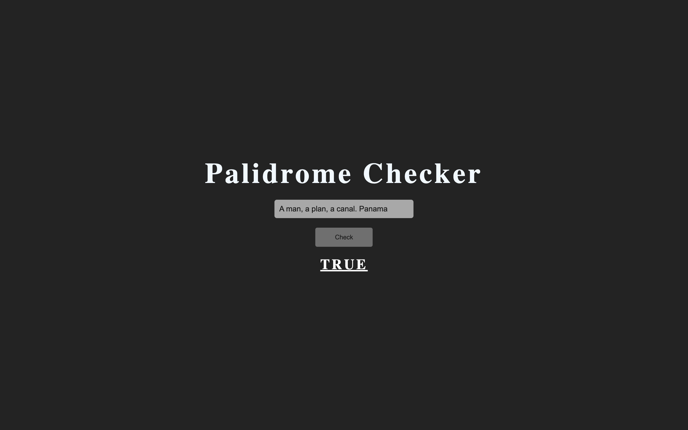

# Palindrome Checker

A small Program that check if input is palindrome (word or sentence that's spelled the same way both forward and backward).  
**This Program is case insensitive and remove all non-alphanumeric characters**

## Screenshots

## Demo

[Link](https://thepageguy.github.io/palindrome_checker/)

## Author

- [@thepageguy](https://www.github.com/thepageguy)

## Acknowledgement

- [FreeCodeCamp](https://www.freecodecamp.org/)

## Tech Stack

**Languages:** HTML5, CSS3 and JavaScript

## Features

- Responsive

## Lessons Learned

- Splitting input into Array
- Medium JS Regex Expressions
- JS Array forEach
- Interdimate JS Array Options

## Feedback

If you have any feedback, please reach out at thepageguy@mailfence.com.
